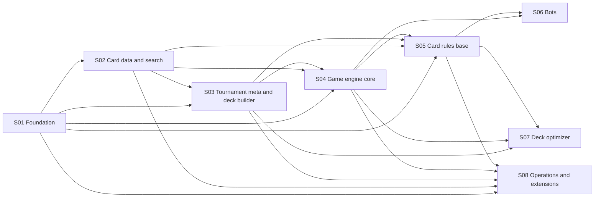

# PokéSearch 2 — execution docs

This tree fragments the project into **8 stages** and **92 nuclear subtasks**. Every subtask is a self-contained `.md` file: a header with
status / order / interlocks, the **inputs it requires** (naming the subtask that provides each one) and the **outputs it proposes** (naming the
consumers), the initial objective, then the detailed body — context, scope, business rules (legacy `RN-nn` and local `BR-` rules with enforcement
point and verification), data operations (CRUD / endpoints / state mutations / user actions), interfaces, implementation steps, edge cases,
runnable acceptance checks, risks and open questions, references. Everything is written in English; the product UI copy stays pt-BR (decision D-006).

## How to read
1. Start with the context docs in [project/](project/): [vision and scope](project/01-vision-and-scope.md), [decision log](project/02-decision-log.md),
   [architecture](project/03-architecture-overview.md), [data model](project/04-data-model-overview.md), [business-rules traceability](project/05-business-rules-traceability.md),
   [legacy reference map](project/06-legacy-reference-map.md), [glossary](project/07-glossary.md), [conventions](project/08-conventions.md).
2. Open a stage README for its objective, exit criteria, ordered subtask table and dependency graph.
3. Open a subtask file; it must be executable from that file plus the context docs alone.

## Status legend
`TODO` not started · `IN_PROGRESS` · `BLOCKED` (waiting on a dependency or a decision) · `DONE` (acceptance checks pass) · `DROPPED` (kept for history).
Statuses live in each file's header table and in the stage README table; update both.

## Stage roadmap
| Stage | Name | Subtasks | Requires stages | Status |
|---|---|---|---|---|
| [S01](stages/01-foundation/README.md) | Foundation | 10 | — | TODO |
| [S02](stages/02-card-data-and-search/README.md) | Card data and search | 14 | S01 | TODO |
| [S03](stages/03-tournament-meta-and-deck-builder/README.md) | Tournament meta and deck builder | 13 | S01, S02 | TODO |
| [S04](stages/04-game-engine-core/README.md) | Game engine core | 18 | S01, S02, S03 | TODO |
| [S05](stages/05-card-rules-base/README.md) | Card rules base | 16 | S01, S02, S03, S04 | TODO |
| [S06](stages/06-bots/README.md) | Bots | 8 | S04, S05 | TODO |
| [S07](stages/07-deck-optimizer/README.md) | Deck optimizer | 7 | S03, S04, S05 | TODO |
| [S08](stages/08-operations-and-extensions/README.md) | Operations and extensions | 6 | S01, S02, S03, S04, S05 | TODO |

Each stage ends with something usable: S01 a wired empty workspace; S02 card search and card pages on freshly loaded data; S03 tournament meta and a deck
builder with import, validation and comparison; S04 a deterministic Rust engine evaluating decks without card effects; S05 the card-rules base with
coverage numbers; S06 competent bots; S07 confirmed deck swaps; S08 operations and extensions.

## Cross-stage interlocks
An arrow means "at least one subtask of the target stage depends on a subtask of the source stage".

## Subtask index
### S01 — Foundation
- [S01.T01](stages/01-foundation/T01-monorepo-skeleton.md) Monorepo skeleton and environment layout
- [S01.T02](stages/01-foundation/T02-sqlite-database-client.md) SQLite database client and portability rules
- [S01.T03](stages/01-foundation/T03-test-database-and-fixtures.md) Test database helper and fixtures
- [S01.T04](stages/01-foundation/T04-database-migration-framework.md) Database migration framework
- [S01.T05](stages/01-foundation/T05-shared-contracts-package.md) Shared contracts package
- [S01.T06](stages/01-foundation/T06-rust-toolchain-gate.md) Rust toolchain gate
- [S01.T07](stages/01-foundation/T07-api-skeleton-and-health.md) API skeleton and health endpoint
- [S01.T08](stages/01-foundation/T08-web-skeleton.md) Web application skeleton
- [S01.T09](stages/01-foundation/T09-licensing-and-notice.md) Licensing and NOTICE
- [S01.T10](stages/01-foundation/T10-quality-gates-and-docs-lint.md) Quality gates and docs lint

### S02 — Card data and search
- [S02.T01](stages/02-card-data-and-search/T01-etl-cli-and-raw-cache.md) ETL CLI, raw cache layout and run log
- [S02.T02](stages/02-card-data-and-search/T02-fetch-pokemon-tcg-data.md) Fetch pokemon-tcg-data (canonical card JSON)
- [S02.T03](stages/02-card-data-and-search/T03-fetch-tcgdex.md) Fetch TCGdex (prices, legality, variants, images)
- [S02.T04](stages/02-card-data-and-search/T04-set-and-card-id-mapping.md) Set and card id mapping between sources
- [S02.T05](stages/02-card-data-and-search/T05-cards-schema-migration.md) Cards schema migration
- [S02.T06](stages/02-card-data-and-search/T06-load-cards.md) Load cards into the database
- [S02.T07](stages/02-card-data-and-search/T07-prices-snapshot.md) Price snapshots
- [S02.T08](stages/02-card-data-and-search/T08-full-text-search.md) Full-text search index and query builder
- [S02.T09](stages/02-card-data-and-search/T09-search-query-model-and-sql.md) Search query model and SQL builder
- [S02.T10](stages/02-card-data-and-search/T10-natural-language-parser.md) Natural-language query parser (pt/en)
- [S02.T11](stages/02-card-data-and-search/T11-api-cards-search-sets.md) API: search, cards, sets, facets
- [S02.T12](stages/02-card-data-and-search/T12-web-search-page.md) Web: search page
- [S02.T13](stages/02-card-data-and-search/T13-web-card-detail-page.md) Web: card detail page
- [S02.T14](stages/02-card-data-and-search/T14-web-sets-page.md) Web: sets page

### S03 — Tournament meta and deck builder
- [S03.T01](stages/03-tournament-meta-and-deck-builder/T01-tournaments-schema-migration.md) Tournaments and decks schema migration
- [S03.T02](stages/03-tournament-meta-and-deck-builder/T02-limitless-api-client.md) Limitless API client
- [S03.T03](stages/03-tournament-meta-and-deck-builder/T03-limitless-web-scraper.md) Limitless web scraper (official events)
- [S03.T04](stages/03-tournament-meta-and-deck-builder/T04-deck-resolver.md) Decklist line resolver
- [S03.T05](stages/03-tournament-meta-and-deck-builder/T05-decks-sync-and-prune.md) Deck synchronisation and pruning
- [S03.T06](stages/03-tournament-meta-and-deck-builder/T06-meta-queries.md) Meta queries: archetypes, partners, alternatives, deck read
- [S03.T07](stages/03-tournament-meta-and-deck-builder/T07-api-meta-endpoints.md) API: meta endpoints
- [S03.T08](stages/03-tournament-meta-and-deck-builder/T08-web-meta-pages.md) Web: meta pages (archetypes, decklists, deck detail)
- [S03.T09](stages/03-tournament-meta-and-deck-builder/T09-decklist-parser-and-exporter.md) Decklist text parser and exporter
- [S03.T10](stages/03-tournament-meta-and-deck-builder/T10-deck-validation-rules.md) Deck validation rules
- [S03.T11](stages/03-tournament-meta-and-deck-builder/T11-user-decks-schema-and-api.md) User decks: schema and API
- [S03.T12](stages/03-tournament-meta-and-deck-builder/T12-web-deck-builder.md) Web: deck builder
- [S03.T13](stages/03-tournament-meta-and-deck-builder/T13-deck-comparison-with-tournament-lists.md) Deck comparison with tournament lists

### S04 — Game engine core
- [S04.T01](stages/04-game-engine-core/T01-engine-workspace-and-crates.md) Engine workspace and crates
- [S04.T02](stages/04-game-engine-core/T02-card-definition-model.md) Card definition model (DB → CardDef)
- [S04.T03](stages/04-game-engine-core/T03-game-state-model.md) Game state model
- [S04.T04](stages/04-game-engine-core/T04-setup-and-turn-structure.md) Setup and turn structure
- [S04.T05](stages/04-game-engine-core/T05-actions-and-legality.md) Actions and legality
- [S04.T06](stages/04-game-engine-core/T06-energy-provision-and-cost-payment.md) Energy provision and cost payment
- [S04.T07](stages/04-game-engine-core/T07-damage-pipeline.md) Damage pipeline
- [S04.T08](stages/04-game-engine-core/T08-special-conditions-and-checkup.md) Special Conditions and Pokémon Checkup
- [S04.T09](stages/04-game-engine-core/T09-prompt-protocol.md) Prompt protocol
- [S04.T10](stages/04-game-engine-core/T10-termination-stall-and-determinism.md) Termination, stall detection and determinism
- [S04.T11](stages/04-game-engine-core/T11-baseline-bots-random-heuristic.md) Baseline bots: random and heuristic
- [S04.T12](stages/04-game-engine-core/T12-cli-job-protocol.md) CLI job protocol (JSON Lines)
- [S04.T13](stages/04-game-engine-core/T13-scenario-format-and-runner.md) Scenario format and runner
- [S04.T14](stages/04-game-engine-core/T14-jobs-schema-migration.md) Jobs schema migration
- [S04.T15](stages/04-game-engine-core/T15-worker-job-runner.md) Worker: job runner
- [S04.T16](stages/04-game-engine-core/T16-api-jobs-and-sse.md) API: jobs and progress events
- [S04.T17](stages/04-game-engine-core/T17-web-evaluate-page.md) Web: Evaluate page
- [S04.T18](stages/04-game-engine-core/T18-performance-baseline.md) Performance baseline

### S05 — Card rules base
- [S05.T01](stages/05-card-rules-base/T01-rules-schema-migration.md) Rules schema migration
- [S05.T02](stages/05-card-rules-base/T02-effect-texts-and-card-parts.md) Effect texts and card parts derivation
- [S05.T03](stages/05-card-rules-base/T03-effect-ir-vocabulary.md) Effect IR vocabulary
- [S05.T04](stages/05-card-rules-base/T04-ir-compiler-and-vm.md) IR compiler and resumable VM
- [S05.T05](stages/05-card-rules-base/T05-continuous-modifiers-and-triggers.md) Continuous modifiers and triggers
- [S05.T06](stages/05-card-rules-base/T06-builtins-escape-hatch.md) Builtins escape hatch
- [S05.T07](stages/05-card-rules-base/T07-rule-codes-composition-semantics.md) Rule codes: composition semantics
- [S05.T08](stages/05-card-rules-base/T08-spreadsheet-import.md) Spreadsheet import (sentences and codes)
- [S05.T09](stages/05-card-rules-base/T09-import-attack-effects-json.md) Import legacy attack effects (412 attacks)
- [S05.T10](stages/05-card-rules-base/T10-import-catalog-recipes.md) Import legacy catalog recipes (262 recipes)
- [S05.T11](stages/05-card-rules-base/T11-legacy-tests-to-scenarios.md) Convert legacy verified tests into scenarios
- [S05.T12](stages/05-card-rules-base/T12-evidence-and-coverage-metrics.md) Evidence recording and coverage metrics
- [S05.T13](stages/05-card-rules-base/T13-rules-editor-ui.md) Web: rules editor
- [S05.T14](stages/05-card-rules-base/T14-coverage-page-and-authoring-queue.md) Web: coverage page and authoring queue
- [S05.T15](stages/05-card-rules-base/T15-rules-export-import-seed.md) Rules export/import (versioned seed)
- [S05.T16](stages/05-card-rules-base/T16-measurement-model-and-suite-v6-freeze.md) Measurement model and benchmark suite v6 freeze

### S06 — Bots
- [S06.T01](stages/06-bots/T01-honest-information-view.md) Honest information view
- [S06.T02](stages/06-bots/T02-deck-profile-analysis.md) Deck profile analysis
- [S06.T03](stages/06-bots/T03-planner-turn-policy.md) Planner bot: turn policy
- [S06.T04](stages/06-bots/T04-need-scoring-and-prompt-resolvers.md) Need scoring and prompt resolvers
- [S06.T05](stages/06-bots/T05-rollout-bot.md) Rollout bot (determinized playouts)
- [S06.T06](stages/06-bots/T06-ismcts-bot.md) ISMCTS bot
- [S06.T07](stages/06-bots/T07-bot-registry-and-freezing.md) Bot registry and freezing
- [S06.T08](stages/06-bots/T08-measurement-score-and-mirror.md) Measurement job: score and mirror

### S07 — Deck optimizer
- [S07.T01](stages/07-deck-optimizer/T01-candidate-pool-and-move-generation.md) Candidate pool and move generation
- [S07.T02](stages/07-deck-optimizer/T02-paired-seed-screening.md) Paired-seed screening
- [S07.T03](stages/07-deck-optimizer/T03-sequential-confirmation.md) Sequential confirmation
- [S07.T04](stages/07-deck-optimizer/T04-holdout-acceptance-and-versioning.md) Holdout acceptance and versioning
- [S07.T05](stages/07-deck-optimizer/T05-optimize-job-orchestration.md) Optimize job orchestration
- [S07.T06](stages/07-deck-optimizer/T06-web-optimizer-page.md) Web: optimizer page
- [S07.T07](stages/07-deck-optimizer/T07-coach-lost-game-review.md) Coach: lost-game review (optional LLM)

### S08 — Operations and extensions
- [S08.T01](stages/08-operations-and-extensions/T01-scheduler.md) Scheduler
- [S08.T02](stages/08-operations-and-extensions/T02-etl-monitoring-and-alerts.md) ETL monitoring and alerts
- [S08.T03](stages/08-operations-and-extensions/T03-hosted-postgres-migration-path.md) Hosted Postgres migration path
- [S08.T04](stages/08-operations-and-extensions/T04-wasm-replay-and-play.md) WASM replay and play
- [S08.T05](stages/08-operations-and-extensions/T05-twinleaf-differential-oracle.md) Twinleaf differential oracle
- [S08.T06](stages/08-operations-and-extensions/T06-llm-assisted-authoring.md) LLM-assisted rule authoring (optional)

## Maintenance
- The `.md` files are the source of truth. When a subtask changes, update its header, its stage README row and the reverse links (`Unblocks`) of its dependencies.
- Subtask [S01.T10](stages/01-foundation/T10-quality-gates-and-docs-lint.md) adds a committed lint that checks IDs, Depends-on/Unblocks symmetry and acyclicity.
- Generated on 2026-09-22 from a one-off generator; no generator is kept in the repo.
