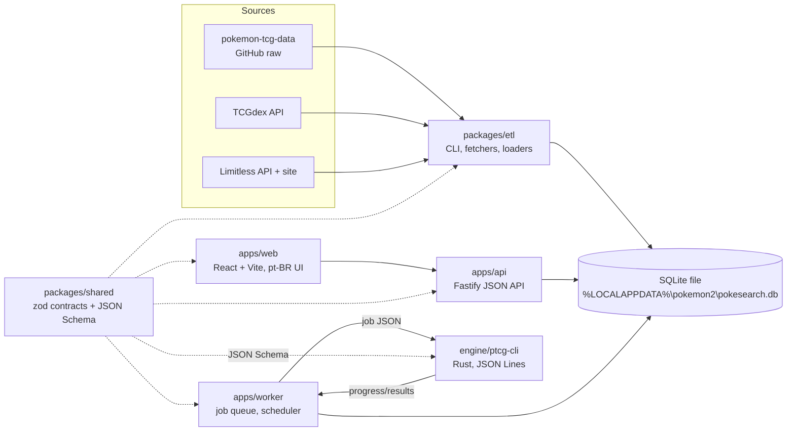
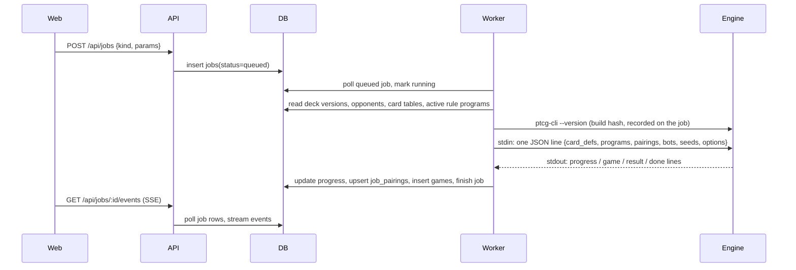

# Architecture overview

| Field | Value |
|---|---|
| Doc | project/03 |
| Status | DRAFT — to be enriched in the elaboration pass |
| Inputs | [Decision log](02-decision-log.md) D-001..D-008; legacy `ESPECIFICACAO.md` §3 (what the old architecture did and where it hurt) |
| Outputs | Component names, process model, contracts and principles that subtask files refer to (`module`, `contract`, `env` inputs) |

## Components

| Component | Responsibility | Owning stages |
|---|---|---|
| `packages/etl` | Fetch sources into `RAW_CACHE_DIR`, map ids, load card tables, snapshot prices, ingest tournaments/decks, rebuild FTS, write `etl_runs` | S02, S03, S08 |
| `packages/db` | SQLite client adapter, migrations (`NNNN_*.sql`), typed rows, dialect module (FTS/JSON), rules composition, export/import seeds | S01, S02, S05 |
| `packages/shared` | zod contracts + inferred types + exported JSON Schema: SearchQuery, Decklist, Effect IR, Job protocol, Scenario, CardDef; pure functions (NL parser, decklist parser, validation) | S01, S02, S03, S04, S05 |
| `apps/api` | JSON API over the database: search, cards, sets, meta, user decks, rules, jobs (SSE progress); binds to `127.0.0.1` | S01, S02, S03, S04, S05 |
| `apps/web` | The site: search, card, sets, meta, deck builder, evaluate, rules editor, coverage, optimizer, measurements, replay | all |
| `apps/worker` | Polls `jobs`, derives card definitions, builds self-contained job JSON, spawns the engine, streams progress into the database; runs the scheduler and optimizer loops | S04, S06, S07, S08 |
| `engine/ptcg-core` | Pure Rust library: state, rules, damage pipeline, conditions, prompts, IR VM, modifiers, bots, scenarios; `Clone` is cheap; no I/O | S04, S05, S06 |
| `engine/ptcg-cli` | JSON Lines over stdio, `rayon` parallel games, `--version` build hash, `--bench`, scenarios runner | S04 |
| `engine/ptcg-wasm` | Same core compiled for the browser: replay and interactive play | S08 |

## Process model (development, single machine)

Three long-running Node processes and one short-lived native child:

1. **api** — `pnpm --filter api dev` — opens the database read/write for user-facing writes (user decks, rules edits, job creation).
2. **worker** — `pnpm --filter worker dev` — the only writer of job/measurement tables and the scheduler host; spawns `ENGINE_BIN` per job.
3. **web** — Vite dev server proxying `/api` to the api.
4. **etl** — CLI runs on demand or from the worker's scheduler.

SQLite in WAL mode with `busy_timeout` allows these processes to share the file; writers keep transactions short. The engine process never opens the database.

## Data flow of a simulation job

## Principles (each is enforced by at least one subtask)

1. **The engine never touches the database.** A job is self-contained; results are lines. (S04.T12, S04.T15)
2. **Node is the only database writer**; the api writes user-facing tables, the worker writes job/measurement tables, the etl writes baseline tables. (S01.T02)
3. **Rules are data.** Card behaviour is `rule_codes` + `text_codes` composed into IR programs; code changes are needed only for new primitives or builtins. (S05)
4. **Two coverage numbers, always together**: exact (intention) and proven (evidence on the current build). Computed in S05.T12, rendered side by side in S05.T14 — the rule is only observable where it is displayed. (RN-70)
5. **Determinism.** One seeded RNG per game, a separate stream per bot, no hash-map iteration in game logic, fingerprints per pairing, identical results at 1 or N workers. (S04.T10)
6. **Frozen rulers.** Suites and frozen bots are immutable; every measurement records engine build, rules snapshot, bot and commit. (S05.T16, S06.T07, S06.T08)
7. **Honest information.** Bots see only what a player sees. (S06.T01)
8. **No LLM on the critical path.** Everything works without API keys; LLM output is a proposal or a review, never evidence. (RN-60, RN-63; S07.T07, S08.T06)
9. **Contracts first.** Every process/language boundary is a zod schema with an exported JSON Schema and a version. (S01.T05)
10. **Postgres-portable schema.** Dialect-specific SQL is isolated; a hosted Postgres is a migration set away. (S01.T02, S02.T08, S08.T03)

## Environment layout

| Variable | Default | Used by |
|---|---|---|
| `DATA_DIR` | `%LOCALAPPDATA%\pokemon2` | all |
| `DATABASE_PATH` | `$DATA_DIR/pokesearch.db` | api, worker, etl |
| `RAW_CACHE_DIR` | `$DATA_DIR/raw` | etl |
| `TCGDEX_CONCURRENCY` | 8 | etl |
| `CARGO_TARGET_DIR` | `$DATA_DIR/target` | engine builds |
| `ENGINE_BIN` | `$CARGO_TARGET_DIR/release/ptcg-cli.exe` | worker |
| `API_PORT` / `WEB_PORT` | 8000 / 5173 | api, web |
| `NODE_ENV` | `development` | api, web, worker, etl |
| `LOG_LEVEL` | `info` | api, worker, etl |
| `MIGRATE_ON_START` | 0 | api, worker (1 runs pending migrations at startup instead of refusing) |
| `SCHEDULER_ENABLED` | 0 | worker |
| `LIMITLESS_API_KEY` | — (optional) | etl |
| `ANTHROPIC_API_KEY`, `LLM_BASE_URL`, `LLM_MODEL` | — (optional) | worker (coach, authoring) |

## What changed versus the legacy architecture

| Legacy (Python) | Here | Why |
|---|---|---|
| Third-party engine + ~10 monkeypatched functions | Own Rust engine, rules as data | No extension points; every engine update broke the patches |
| HP subtraction, `provides` frozen at attach | Damage counters, energy as a query at payment time | Prism/Legacy energy and cost reductions were not representable |
| Generator coroutines, no cloning | Frame stack inside a cloneable state | Enables rollout/ISMCTS bots |
| C(n,k) choice spaces, prose prompts | Structured prompts with `actor`/`purpose`, O(n) validation | 400-action scan cap and string-matching bots |
| Three notions of "correct" (`card_impl`, `card_audit`, `verified_cards.json`) | One model: code status × insert-only evidence | Two divergent coverage numbers |
| HTMX server-rendered pages, in-process threads | JSON API + React, worker process, SSE | Long jobs survive page reloads; UI state in URLs |
| Schema-on-connect, no migrations | Numbered SQL migrations, typed rows | Reproducible schema versions |

[Docs index](../README.md) · [Data model](04-data-model-overview.md) · [Conventions](08-conventions.md)
