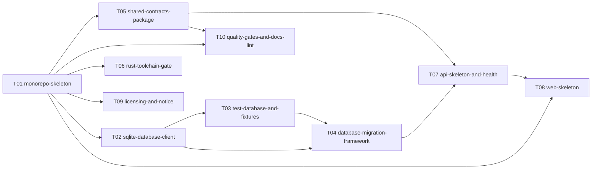

# S01 — Foundation

| Field | Value |
|---|---|
| Status | TODO |
| Subtasks | 10 |
| Requires from other stages | — |
| Feeds other stages | [S02.T01](../02-card-data-and-search/T01-etl-cli-and-raw-cache.md), [S02.T05](../02-card-data-and-search/T05-cards-schema-migration.md), [S02.T09](../02-card-data-and-search/T09-search-query-model-and-sql.md), [S02.T10](../02-card-data-and-search/T10-natural-language-parser.md), [S02.T11](../02-card-data-and-search/T11-api-cards-search-sets.md), [S02.T12](../02-card-data-and-search/T12-web-search-page.md), [S02.T13](../02-card-data-and-search/T13-web-card-detail-page.md), [S02.T14](../02-card-data-and-search/T14-web-sets-page.md), [S03.T01](../03-tournament-meta-and-deck-builder/T01-tournaments-schema-migration.md), [S03.T07](../03-tournament-meta-and-deck-builder/T07-api-meta-endpoints.md), [S03.T08](../03-tournament-meta-and-deck-builder/T08-web-meta-pages.md), [S03.T09](../03-tournament-meta-and-deck-builder/T09-decklist-parser-and-exporter.md), [S03.T11](../03-tournament-meta-and-deck-builder/T11-user-decks-schema-and-api.md), [S04.T01](../04-game-engine-core/T01-engine-workspace-and-crates.md), [S04.T02](../04-game-engine-core/T02-card-definition-model.md), [S04.T12](../04-game-engine-core/T12-cli-job-protocol.md), [S04.T13](../04-game-engine-core/T13-scenario-format-and-runner.md), [S04.T14](../04-game-engine-core/T14-jobs-schema-migration.md), [S04.T16](../04-game-engine-core/T16-api-jobs-and-sse.md), [S05.T01](../05-card-rules-base/T01-rules-schema-migration.md), [S05.T03](../05-card-rules-base/T03-effect-ir-vocabulary.md), [S05.T13](../05-card-rules-base/T13-rules-editor-ui.md), [S05.T14](../05-card-rules-base/T14-coverage-page-and-authoring-queue.md), [S08.T03](../08-operations-and-extensions/T03-hosted-postgres-migration-path.md) |

## Objective
Stand up an empty but fully wired workspace: pnpm monorepo, local SQLite database client and migration framework with heavy artifacts kept outside OneDrive, shared zod contracts, API and web shells, licensing notice, quality gates — and settle the Rust toolchain gate (D-001) before any engine work is scheduled.

## Exit criteria
- [ ] `pnpm install && pnpm check` passes on a fresh clone; `GET /health` returns the SQLite version, database path and zero counts.
- [ ] Rust gate decided and recorded in the decision log (GNU-target build of a hello CLI with rayon/serde and a wasm32 build both green, or the TypeScript fallback chosen).
- [ ] No path under OneDrive is used for the database, raw cache or Cargo target when the defaults are taken.
- [ ] `docs/NOTICE.md` exists; docs lint runs clean on this tree.

## Subtasks (execution order)
| # | ID | Title | Depends on | Gate | Status |
|---|---|---|---|---|---|
| 1 | [S01.T01](T01-monorepo-skeleton.md) | Monorepo skeleton and environment layout | — | no | TODO |
| 2 | [S01.T02](T02-sqlite-database-client.md) | SQLite database client and portability rules | [S01.T01](T01-monorepo-skeleton.md) | no | TODO |
| 3 | [S01.T03](T03-test-database-and-fixtures.md) | Test database helper and fixtures | [S01.T02](T02-sqlite-database-client.md) | no | TODO |
| 4 | [S01.T04](T04-database-migration-framework.md) | Database migration framework | [S01.T02](T02-sqlite-database-client.md), [S01.T03](T03-test-database-and-fixtures.md) | no | TODO |
| 5 | [S01.T05](T05-shared-contracts-package.md) | Shared contracts package | [S01.T01](T01-monorepo-skeleton.md) | no | TODO |
| 6 | [S01.T06](T06-rust-toolchain-gate.md) | Rust toolchain gate | [S01.T01](T01-monorepo-skeleton.md) | yes | TODO |
| 7 | [S01.T07](T07-api-skeleton-and-health.md) | API skeleton and health endpoint | [S01.T04](T04-database-migration-framework.md), [S01.T05](T05-shared-contracts-package.md) | no | TODO |
| 8 | [S01.T08](T08-web-skeleton.md) | Web application skeleton | [S01.T01](T01-monorepo-skeleton.md), [S01.T07](T07-api-skeleton-and-health.md) | no | TODO |
| 9 | [S01.T09](T09-licensing-and-notice.md) | Licensing and NOTICE | [S01.T01](T01-monorepo-skeleton.md) | no | TODO |
| 10 | [S01.T10](T10-quality-gates-and-docs-lint.md) | Quality gates and docs lint | [S01.T01](T01-monorepo-skeleton.md), [S01.T05](T05-shared-contracts-package.md) | no | TODO |

Order follows the ID sequence; a subtask starts only when every "Depends on" item is DONE (see [Conventions](../../project/08-conventions.md)). Subtasks with the same topological level and no mutual dependency may run in parallel (listed in each file's "Parallel with").

## Dependency graph
Solid arrows: inside this stage. Dashed: inputs from earlier stages.

## Cross-stage interlocks
- Required inputs: —
- Delivered to: [S02.T01](../02-card-data-and-search/T01-etl-cli-and-raw-cache.md), [S02.T05](../02-card-data-and-search/T05-cards-schema-migration.md), [S02.T09](../02-card-data-and-search/T09-search-query-model-and-sql.md), [S02.T10](../02-card-data-and-search/T10-natural-language-parser.md), [S02.T11](../02-card-data-and-search/T11-api-cards-search-sets.md), [S02.T12](../02-card-data-and-search/T12-web-search-page.md), [S02.T13](../02-card-data-and-search/T13-web-card-detail-page.md), [S02.T14](../02-card-data-and-search/T14-web-sets-page.md), [S03.T01](../03-tournament-meta-and-deck-builder/T01-tournaments-schema-migration.md), [S03.T07](../03-tournament-meta-and-deck-builder/T07-api-meta-endpoints.md), [S03.T08](../03-tournament-meta-and-deck-builder/T08-web-meta-pages.md), [S03.T09](../03-tournament-meta-and-deck-builder/T09-decklist-parser-and-exporter.md), [S03.T11](../03-tournament-meta-and-deck-builder/T11-user-decks-schema-and-api.md), [S04.T01](../04-game-engine-core/T01-engine-workspace-and-crates.md), [S04.T02](../04-game-engine-core/T02-card-definition-model.md), [S04.T12](../04-game-engine-core/T12-cli-job-protocol.md), [S04.T13](../04-game-engine-core/T13-scenario-format-and-runner.md), [S04.T14](../04-game-engine-core/T14-jobs-schema-migration.md), [S04.T16](../04-game-engine-core/T16-api-jobs-and-sse.md), [S05.T01](../05-card-rules-base/T01-rules-schema-migration.md), [S05.T03](../05-card-rules-base/T03-effect-ir-vocabulary.md), [S05.T13](../05-card-rules-base/T13-rules-editor-ui.md), [S05.T14](../05-card-rules-base/T14-coverage-page-and-authoring-queue.md), [S08.T03](../08-operations-and-extensions/T03-hosted-postgres-migration-path.md)

---
[Docs index](../../README.md) · [Conventions](../../project/08-conventions.md)
