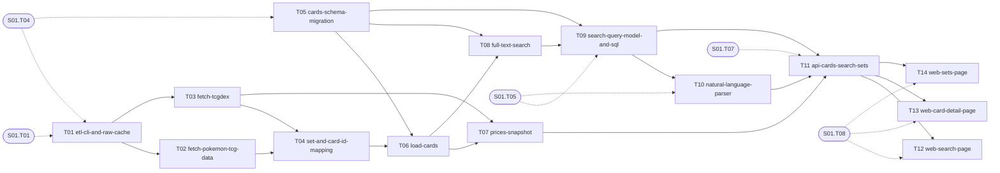

# S02 — Card data and search

| Field | Value |
|---|---|
| Status | TODO |
| Subtasks | 14 |
| Requires from other stages | [S01.T01](../01-foundation/T01-monorepo-skeleton.md), [S01.T04](../01-foundation/T04-database-migration-framework.md), [S01.T05](../01-foundation/T05-shared-contracts-package.md), [S01.T07](../01-foundation/T07-api-skeleton-and-health.md), [S01.T08](../01-foundation/T08-web-skeleton.md) |
| Feeds other stages | [S03.T01](../03-tournament-meta-and-deck-builder/T01-tournaments-schema-migration.md), [S03.T02](../03-tournament-meta-and-deck-builder/T02-limitless-api-client.md), [S03.T03](../03-tournament-meta-and-deck-builder/T03-limitless-web-scraper.md), [S03.T04](../03-tournament-meta-and-deck-builder/T04-deck-resolver.md), [S03.T06](../03-tournament-meta-and-deck-builder/T06-meta-queries.md), [S03.T08](../03-tournament-meta-and-deck-builder/T08-web-meta-pages.md), [S03.T10](../03-tournament-meta-and-deck-builder/T10-deck-validation-rules.md), [S03.T12](../03-tournament-meta-and-deck-builder/T12-web-deck-builder.md), [S04.T02](../04-game-engine-core/T02-card-definition-model.md), [S05.T01](../05-card-rules-base/T01-rules-schema-migration.md), [S05.T02](../05-card-rules-base/T02-effect-texts-and-card-parts.md), [S08.T01](../08-operations-and-extensions/T01-scheduler.md), [S08.T02](../08-operations-and-extensions/T02-etl-monitoring-and-alerts.md), [S08.T03](../08-operations-and-extensions/T03-hosted-postgres-migration-path.md) |

## Objective
Rebuild the card database from the public sources with a new TypeScript ETL (pokemon-tcg-data as canonical English text, TCGdex for prices/legality/images), index it for full-text search, and ship the first usable screens: attribute + natural-language search (pt/en), card detail with prices, and the sets list.

## Exit criteria
- [ ] `etl full` from an empty database ends with ≈174 sets and ≈20.4k cards, attacks/abilities/weaknesses/resistances populated, unmatched ids reported in `etl_runs.stats_json`.
- [ ] Search page answers 'pokémon de fogo com mais de 200 hp desde 2023' with the right 'interpreted as' chips and results; every filter and sort of the legacy UI is reachable.
- [ ] Card page shows official texts, legality from both sources side by side, variants, price table and sparkline, other printings.
- [ ] All search/NL unit tests (ported legacy cases) pass; `pnpm check` green.

## Subtasks (execution order)
| # | ID | Title | Depends on | Gate | Status |
|---|---|---|---|---|---|
| 1 | [S02.T01](T01-etl-cli-and-raw-cache.md) | ETL CLI, raw cache layout and run log | [S01.T01](../01-foundation/T01-monorepo-skeleton.md), [S01.T04](../01-foundation/T04-database-migration-framework.md) | no | TODO |
| 2 | [S02.T02](T02-fetch-pokemon-tcg-data.md) | Fetch pokemon-tcg-data (canonical card JSON) | [S02.T01](T01-etl-cli-and-raw-cache.md) | no | TODO |
| 3 | [S02.T03](T03-fetch-tcgdex.md) | Fetch TCGdex (prices, legality, variants, images) | [S02.T01](T01-etl-cli-and-raw-cache.md) | no | TODO |
| 4 | [S02.T04](T04-set-and-card-id-mapping.md) | Set and card id mapping between sources | [S02.T02](T02-fetch-pokemon-tcg-data.md), [S02.T03](T03-fetch-tcgdex.md) | no | TODO |
| 5 | [S02.T05](T05-cards-schema-migration.md) | Cards schema migration | [S01.T04](../01-foundation/T04-database-migration-framework.md) | no | TODO |
| 6 | [S02.T06](T06-load-cards.md) | Load cards into the database | [S02.T04](T04-set-and-card-id-mapping.md), [S02.T05](T05-cards-schema-migration.md) | no | TODO |
| 7 | [S02.T07](T07-prices-snapshot.md) | Price snapshots | [S02.T03](T03-fetch-tcgdex.md), [S02.T06](T06-load-cards.md) | no | TODO |
| 8 | [S02.T08](T08-full-text-search.md) | Full-text search index and query builder | [S02.T05](T05-cards-schema-migration.md), [S02.T06](T06-load-cards.md) | no | TODO |
| 9 | [S02.T09](T09-search-query-model-and-sql.md) | Search query model and SQL builder | [S01.T05](../01-foundation/T05-shared-contracts-package.md), [S02.T05](T05-cards-schema-migration.md), [S02.T08](T08-full-text-search.md) | no | TODO |
| 10 | [S02.T10](T10-natural-language-parser.md) | Natural-language query parser (pt/en) | [S01.T05](../01-foundation/T05-shared-contracts-package.md), [S02.T09](T09-search-query-model-and-sql.md) | no | TODO |
| 11 | [S02.T11](T11-api-cards-search-sets.md) | API: search, cards, sets, facets | [S01.T07](../01-foundation/T07-api-skeleton-and-health.md), [S02.T07](T07-prices-snapshot.md), [S02.T09](T09-search-query-model-and-sql.md), [S02.T10](T10-natural-language-parser.md) | no | TODO |
| 12 | [S02.T12](T12-web-search-page.md) | Web: search page | [S01.T08](../01-foundation/T08-web-skeleton.md), [S02.T11](T11-api-cards-search-sets.md) | no | TODO |
| 13 | [S02.T13](T13-web-card-detail-page.md) | Web: card detail page | [S01.T08](../01-foundation/T08-web-skeleton.md), [S02.T11](T11-api-cards-search-sets.md) | no | TODO |
| 14 | [S02.T14](T14-web-sets-page.md) | Web: sets page | [S01.T08](../01-foundation/T08-web-skeleton.md), [S02.T11](T11-api-cards-search-sets.md) | no | TODO |

Order follows the ID sequence; a subtask starts only when every "Depends on" item is DONE (see [Conventions](../../project/08-conventions.md)). Subtasks with the same topological level and no mutual dependency may run in parallel (listed in each file's "Parallel with").

## Dependency graph
Solid arrows: inside this stage. Dashed: inputs from earlier stages.

## Cross-stage interlocks
- Required inputs: [S01.T01](../01-foundation/T01-monorepo-skeleton.md), [S01.T04](../01-foundation/T04-database-migration-framework.md), [S01.T05](../01-foundation/T05-shared-contracts-package.md), [S01.T07](../01-foundation/T07-api-skeleton-and-health.md), [S01.T08](../01-foundation/T08-web-skeleton.md)
- Delivered to: [S03.T01](../03-tournament-meta-and-deck-builder/T01-tournaments-schema-migration.md), [S03.T02](../03-tournament-meta-and-deck-builder/T02-limitless-api-client.md), [S03.T03](../03-tournament-meta-and-deck-builder/T03-limitless-web-scraper.md), [S03.T04](../03-tournament-meta-and-deck-builder/T04-deck-resolver.md), [S03.T06](../03-tournament-meta-and-deck-builder/T06-meta-queries.md), [S03.T08](../03-tournament-meta-and-deck-builder/T08-web-meta-pages.md), [S03.T10](../03-tournament-meta-and-deck-builder/T10-deck-validation-rules.md), [S03.T12](../03-tournament-meta-and-deck-builder/T12-web-deck-builder.md), [S04.T02](../04-game-engine-core/T02-card-definition-model.md), [S05.T01](../05-card-rules-base/T01-rules-schema-migration.md), [S05.T02](../05-card-rules-base/T02-effect-texts-and-card-parts.md), [S08.T01](../08-operations-and-extensions/T01-scheduler.md), [S08.T02](../08-operations-and-extensions/T02-etl-monitoring-and-alerts.md), [S08.T03](../08-operations-and-extensions/T03-hosted-postgres-migration-path.md)

---
[Docs index](../../README.md) · [Conventions](../../project/08-conventions.md)
