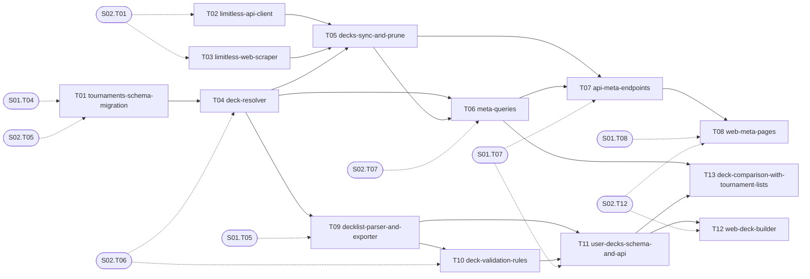

# S03 — Tournament meta and deck builder

| Field | Value |
|---|---|
| Status | TODO |
| Subtasks | 13 |
| Requires from other stages | [S01.T04](../01-foundation/T04-database-migration-framework.md), [S01.T05](../01-foundation/T05-shared-contracts-package.md), [S01.T07](../01-foundation/T07-api-skeleton-and-health.md), [S01.T08](../01-foundation/T08-web-skeleton.md), [S02.T01](../02-card-data-and-search/T01-etl-cli-and-raw-cache.md), [S02.T05](../02-card-data-and-search/T05-cards-schema-migration.md), [S02.T06](../02-card-data-and-search/T06-load-cards.md), [S02.T07](../02-card-data-and-search/T07-prices-snapshot.md), [S02.T12](../02-card-data-and-search/T12-web-search-page.md) |
| Feeds other stages | [S04.T17](../04-game-engine-core/T17-web-evaluate-page.md), [S05.T12](../05-card-rules-base/T12-evidence-and-coverage-metrics.md), [S05.T16](../05-card-rules-base/T16-measurement-model-and-suite-v6-freeze.md), [S07.T01](../07-deck-optimizer/T01-candidate-pool-and-move-generation.md), [S07.T04](../07-deck-optimizer/T04-holdout-acceptance-and-versioning.md), [S08.T01](../08-operations-and-extensions/T01-scheduler.md), [S08.T02](../08-operations-and-extensions/T02-etl-monitoring-and-alerts.md) |

## Objective
Ingest the competitive meta (Limitless API + official-event scraping), resolve every decklist line to a card, expose archetypes/partners/alternatives, and give the user a real deck builder: paste or build a list, validate it against the format rules, version it, compare it with tournament lists of the same archetype and export it back in TCG Live format.

## Exit criteria
- [ ] `etl decks --web` populates ≈400 tournaments and tens of thousands of decks with ≥ 99.9 % of lines resolved; unresolved lines reported.
- [ ] Meta pages: pick up to 6 Pokémon → archetype panels, ranked decklists, partners, alternatives; deck detail with price total and export.
- [ ] Pasting the legacy Dhelmise list (60 cards) resolves 60/60, validates, prices, compares against its archetype and exports identical text.
- [ ] Deck versions with human-readable diffs are stored in `user_deck_versions`.

## Subtasks (execution order)
| # | ID | Title | Depends on | Gate | Status |
|---|---|---|---|---|---|
| 1 | [S03.T01](T01-tournaments-schema-migration.md) | Tournaments and decks schema migration | [S01.T04](../01-foundation/T04-database-migration-framework.md), [S02.T05](../02-card-data-and-search/T05-cards-schema-migration.md) | no | TODO |
| 2 | [S03.T02](T02-limitless-api-client.md) | Limitless API client | [S02.T01](../02-card-data-and-search/T01-etl-cli-and-raw-cache.md) | no | TODO |
| 3 | [S03.T03](T03-limitless-web-scraper.md) | Limitless web scraper (official events) | [S02.T01](../02-card-data-and-search/T01-etl-cli-and-raw-cache.md) | no | TODO |
| 4 | [S03.T04](T04-deck-resolver.md) | Decklist line resolver | [S02.T06](../02-card-data-and-search/T06-load-cards.md), [S03.T01](T01-tournaments-schema-migration.md) | no | TODO |
| 5 | [S03.T05](T05-decks-sync-and-prune.md) | Deck synchronisation and pruning | [S03.T02](T02-limitless-api-client.md), [S03.T03](T03-limitless-web-scraper.md), [S03.T04](T04-deck-resolver.md) | no | TODO |
| 6 | [S03.T06](T06-meta-queries.md) | Meta queries: archetypes, partners, alternatives, deck read | [S02.T07](../02-card-data-and-search/T07-prices-snapshot.md), [S03.T04](T04-deck-resolver.md), [S03.T05](T05-decks-sync-and-prune.md) | no | TODO |
| 7 | [S03.T07](T07-api-meta-endpoints.md) | API: meta endpoints | [S01.T07](../01-foundation/T07-api-skeleton-and-health.md), [S03.T05](T05-decks-sync-and-prune.md), [S03.T06](T06-meta-queries.md) | no | TODO |
| 8 | [S03.T08](T08-web-meta-pages.md) | Web: meta pages (archetypes, decklists, deck detail) | [S01.T08](../01-foundation/T08-web-skeleton.md), [S02.T12](../02-card-data-and-search/T12-web-search-page.md), [S03.T07](T07-api-meta-endpoints.md) | no | TODO |
| 9 | [S03.T09](T09-decklist-parser-and-exporter.md) | Decklist text parser and exporter | [S01.T05](../01-foundation/T05-shared-contracts-package.md), [S03.T04](T04-deck-resolver.md) | no | TODO |
| 10 | [S03.T10](T10-deck-validation-rules.md) | Deck validation rules | [S02.T06](../02-card-data-and-search/T06-load-cards.md), [S03.T09](T09-decklist-parser-and-exporter.md) | no | TODO |
| 11 | [S03.T11](T11-user-decks-schema-and-api.md) | User decks: schema and API | [S01.T07](../01-foundation/T07-api-skeleton-and-health.md), [S03.T09](T09-decklist-parser-and-exporter.md), [S03.T10](T10-deck-validation-rules.md) | no | TODO |
| 12 | [S03.T12](T12-web-deck-builder.md) | Web: deck builder | [S02.T12](../02-card-data-and-search/T12-web-search-page.md), [S03.T11](T11-user-decks-schema-and-api.md) | no | TODO |
| 13 | [S03.T13](T13-deck-comparison-with-tournament-lists.md) | Deck comparison with tournament lists | [S03.T06](T06-meta-queries.md), [S03.T11](T11-user-decks-schema-and-api.md) | no | TODO |

Order follows the ID sequence; a subtask starts only when every "Depends on" item is DONE (see [Conventions](../../project/08-conventions.md)). Subtasks with the same topological level and no mutual dependency may run in parallel (listed in each file's "Parallel with").

## Dependency graph
Solid arrows: inside this stage. Dashed: inputs from earlier stages.

## Cross-stage interlocks
- Required inputs: [S01.T04](../01-foundation/T04-database-migration-framework.md), [S01.T05](../01-foundation/T05-shared-contracts-package.md), [S01.T07](../01-foundation/T07-api-skeleton-and-health.md), [S01.T08](../01-foundation/T08-web-skeleton.md), [S02.T01](../02-card-data-and-search/T01-etl-cli-and-raw-cache.md), [S02.T05](../02-card-data-and-search/T05-cards-schema-migration.md), [S02.T06](../02-card-data-and-search/T06-load-cards.md), [S02.T07](../02-card-data-and-search/T07-prices-snapshot.md), [S02.T12](../02-card-data-and-search/T12-web-search-page.md)
- Delivered to: [S04.T17](../04-game-engine-core/T17-web-evaluate-page.md), [S05.T12](../05-card-rules-base/T12-evidence-and-coverage-metrics.md), [S05.T16](../05-card-rules-base/T16-measurement-model-and-suite-v6-freeze.md), [S07.T01](../07-deck-optimizer/T01-candidate-pool-and-move-generation.md), [S07.T04](../07-deck-optimizer/T04-holdout-acceptance-and-versioning.md), [S08.T01](../08-operations-and-extensions/T01-scheduler.md), [S08.T02](../08-operations-and-extensions/T02-etl-monitoring-and-alerts.md)

---
[Docs index](../../README.md) · [Conventions](../../project/08-conventions.md)
