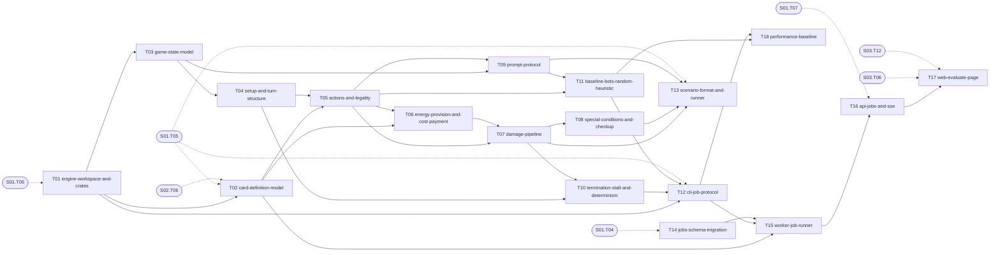

# S04 — Game engine core

| Field | Value |
|---|---|
| Status | TODO |
| Subtasks | 18 |
| Requires from other stages | [S01.T04](../01-foundation/T04-database-migration-framework.md), [S01.T05](../01-foundation/T05-shared-contracts-package.md), [S01.T06](../01-foundation/T06-rust-toolchain-gate.md), [S01.T07](../01-foundation/T07-api-skeleton-and-health.md), [S02.T06](../02-card-data-and-search/T06-load-cards.md), [S03.T06](../03-tournament-meta-and-deck-builder/T06-meta-queries.md), [S03.T12](../03-tournament-meta-and-deck-builder/T12-web-deck-builder.md) |
| Feeds other stages | [S05.T03](../05-card-rules-base/T03-effect-ir-vocabulary.md), [S05.T04](../05-card-rules-base/T04-ir-compiler-and-vm.md), [S05.T05](../05-card-rules-base/T05-continuous-modifiers-and-triggers.md), [S05.T11](../05-card-rules-base/T11-legacy-tests-to-scenarios.md), [S05.T12](../05-card-rules-base/T12-evidence-and-coverage-metrics.md), [S05.T16](../05-card-rules-base/T16-measurement-model-and-suite-v6-freeze.md), [S06.T01](../06-bots/T01-honest-information-view.md), [S06.T02](../06-bots/T02-deck-profile-analysis.md), [S06.T03](../06-bots/T03-planner-turn-policy.md), [S06.T04](../06-bots/T04-need-scoring-and-prompt-resolvers.md), [S06.T05](../06-bots/T05-rollout-bot.md), [S06.T07](../06-bots/T07-bot-registry-and-freezing.md), [S06.T08](../06-bots/T08-measurement-score-and-mirror.md), [S07.T02](../07-deck-optimizer/T02-paired-seed-screening.md), [S07.T05](../07-deck-optimizer/T05-optimize-job-orchestration.md), [S07.T06](../07-deck-optimizer/T06-web-optimizer-page.md), [S07.T07](../07-deck-optimizer/T07-coach-lost-game-review.md), [S08.T01](../08-operations-and-extensions/T01-scheduler.md), [S08.T04](../08-operations-and-extensions/T04-wasm-replay-and-play.md), [S08.T05](../08-operations-and-extensions/T05-twinleaf-differential-oracle.md) |

## Objective
Build the deterministic Rust engine that plays complete Pokémon TCG games with effect-less cards (attributes, printed damage, energy, evolution, prizes, Special Conditions, rulebook corrections), expose it through a JSON Lines job protocol driven by a Node worker, and give the user an Evaluate page that measures a deck against weighted meta opponents with confidence intervals.

## Exit criteria
- [ ] 10,000 games between two effect-less decks run to completion; identical per-pairing fingerprints at `--workers 1` and `--workers 16` and across two runs.
- [ ] All rulebook scenarios (RN-10..RN-21) pass in `cargo test`.
- [ ] Evaluate page launches a job, shows live per-opponent progress and stores the weighted score with a 95 % CI.
- [ ] `docs/PERF.md` records games/s at 1/8/16 workers (target ≥ 5,000 games/s with heuristic bots on this machine).

## Subtasks (execution order)
| # | ID | Title | Depends on | Gate | Status |
|---|---|---|---|---|---|
| 1 | [S04.T01](T01-engine-workspace-and-crates.md) | Engine workspace and crates | [S01.T06](../01-foundation/T06-rust-toolchain-gate.md) | no | TODO |
| 2 | [S04.T02](T02-card-definition-model.md) | Card definition model (DB → CardDef) | [S01.T05](../01-foundation/T05-shared-contracts-package.md), [S02.T06](../02-card-data-and-search/T06-load-cards.md), [S04.T01](T01-engine-workspace-and-crates.md) | no | TODO |
| 3 | [S04.T03](T03-game-state-model.md) | Game state model | [S04.T01](T01-engine-workspace-and-crates.md) | no | TODO |
| 4 | [S04.T04](T04-setup-and-turn-structure.md) | Setup and turn structure | [S04.T03](T03-game-state-model.md) | no | TODO |
| 5 | [S04.T05](T05-actions-and-legality.md) | Actions and legality | [S04.T02](T02-card-definition-model.md), [S04.T04](T04-setup-and-turn-structure.md) | no | TODO |
| 6 | [S04.T06](T06-energy-provision-and-cost-payment.md) | Energy provision and cost payment | [S04.T02](T02-card-definition-model.md), [S04.T05](T05-actions-and-legality.md) | no | TODO |
| 7 | [S04.T07](T07-damage-pipeline.md) | Damage pipeline | [S04.T05](T05-actions-and-legality.md), [S04.T06](T06-energy-provision-and-cost-payment.md) | no | TODO |
| 8 | [S04.T08](T08-special-conditions-and-checkup.md) | Special Conditions and Pokémon Checkup | [S04.T07](T07-damage-pipeline.md) | no | TODO |
| 9 | [S04.T09](T09-prompt-protocol.md) | Prompt protocol | [S04.T03](T03-game-state-model.md), [S04.T05](T05-actions-and-legality.md) | no | TODO |
| 10 | [S04.T10](T10-termination-stall-and-determinism.md) | Termination, stall detection and determinism | [S04.T04](T04-setup-and-turn-structure.md), [S04.T07](T07-damage-pipeline.md) | no | TODO |
| 11 | [S04.T11](T11-baseline-bots-random-heuristic.md) | Baseline bots: random and heuristic | [S04.T05](T05-actions-and-legality.md), [S04.T09](T09-prompt-protocol.md) | no | TODO |
| 12 | [S04.T12](T12-cli-job-protocol.md) | CLI job protocol (JSON Lines) | [S01.T05](../01-foundation/T05-shared-contracts-package.md), [S04.T01](T01-engine-workspace-and-crates.md), [S04.T10](T10-termination-stall-and-determinism.md), [S04.T11](T11-baseline-bots-random-heuristic.md) | no | TODO |
| 13 | [S04.T13](T13-scenario-format-and-runner.md) | Scenario format and runner | [S01.T05](../01-foundation/T05-shared-contracts-package.md), [S04.T07](T07-damage-pipeline.md), [S04.T08](T08-special-conditions-and-checkup.md), [S04.T09](T09-prompt-protocol.md) | no | TODO |
| 14 | [S04.T14](T14-jobs-schema-migration.md) | Jobs schema migration | [S01.T04](../01-foundation/T04-database-migration-framework.md) | no | TODO |
| 15 | [S04.T15](T15-worker-job-runner.md) | Worker: job runner | [S04.T02](T02-card-definition-model.md), [S04.T12](T12-cli-job-protocol.md), [S04.T14](T14-jobs-schema-migration.md) | no | TODO |
| 16 | [S04.T16](T16-api-jobs-and-sse.md) | API: jobs and progress events | [S01.T07](../01-foundation/T07-api-skeleton-and-health.md), [S04.T15](T15-worker-job-runner.md) | no | TODO |
| 17 | [S04.T17](T17-web-evaluate-page.md) | Web: Evaluate page | [S03.T06](../03-tournament-meta-and-deck-builder/T06-meta-queries.md), [S03.T12](../03-tournament-meta-and-deck-builder/T12-web-deck-builder.md), [S04.T16](T16-api-jobs-and-sse.md) | no | TODO |
| 18 | [S04.T18](T18-performance-baseline.md) | Performance baseline | [S04.T11](T11-baseline-bots-random-heuristic.md), [S04.T12](T12-cli-job-protocol.md) | no | TODO |

Order follows the ID sequence; a subtask starts only when every "Depends on" item is DONE (see [Conventions](../../project/08-conventions.md)). Subtasks with the same topological level and no mutual dependency may run in parallel (listed in each file's "Parallel with").

## Dependency graph
Solid arrows: inside this stage. Dashed: inputs from earlier stages.

## Cross-stage interlocks
- Required inputs: [S01.T04](../01-foundation/T04-database-migration-framework.md), [S01.T05](../01-foundation/T05-shared-contracts-package.md), [S01.T06](../01-foundation/T06-rust-toolchain-gate.md), [S01.T07](../01-foundation/T07-api-skeleton-and-health.md), [S02.T06](../02-card-data-and-search/T06-load-cards.md), [S03.T06](../03-tournament-meta-and-deck-builder/T06-meta-queries.md), [S03.T12](../03-tournament-meta-and-deck-builder/T12-web-deck-builder.md)
- Delivered to: [S05.T03](../05-card-rules-base/T03-effect-ir-vocabulary.md), [S05.T04](../05-card-rules-base/T04-ir-compiler-and-vm.md), [S05.T05](../05-card-rules-base/T05-continuous-modifiers-and-triggers.md), [S05.T11](../05-card-rules-base/T11-legacy-tests-to-scenarios.md), [S05.T12](../05-card-rules-base/T12-evidence-and-coverage-metrics.md), [S05.T16](../05-card-rules-base/T16-measurement-model-and-suite-v6-freeze.md), [S06.T01](../06-bots/T01-honest-information-view.md), [S06.T02](../06-bots/T02-deck-profile-analysis.md), [S06.T03](../06-bots/T03-planner-turn-policy.md), [S06.T04](../06-bots/T04-need-scoring-and-prompt-resolvers.md), [S06.T05](../06-bots/T05-rollout-bot.md), [S06.T07](../06-bots/T07-bot-registry-and-freezing.md), [S06.T08](../06-bots/T08-measurement-score-and-mirror.md), [S07.T02](../07-deck-optimizer/T02-paired-seed-screening.md), [S07.T05](../07-deck-optimizer/T05-optimize-job-orchestration.md), [S07.T06](../07-deck-optimizer/T06-web-optimizer-page.md), [S07.T07](../07-deck-optimizer/T07-coach-lost-game-review.md), [S08.T01](../08-operations-and-extensions/T01-scheduler.md), [S08.T04](../08-operations-and-extensions/T04-wasm-replay-and-play.md), [S08.T05](../08-operations-and-extensions/T05-twinleaf-differential-oracle.md)

---
[Docs index](../../README.md) · [Conventions](../../project/08-conventions.md)
