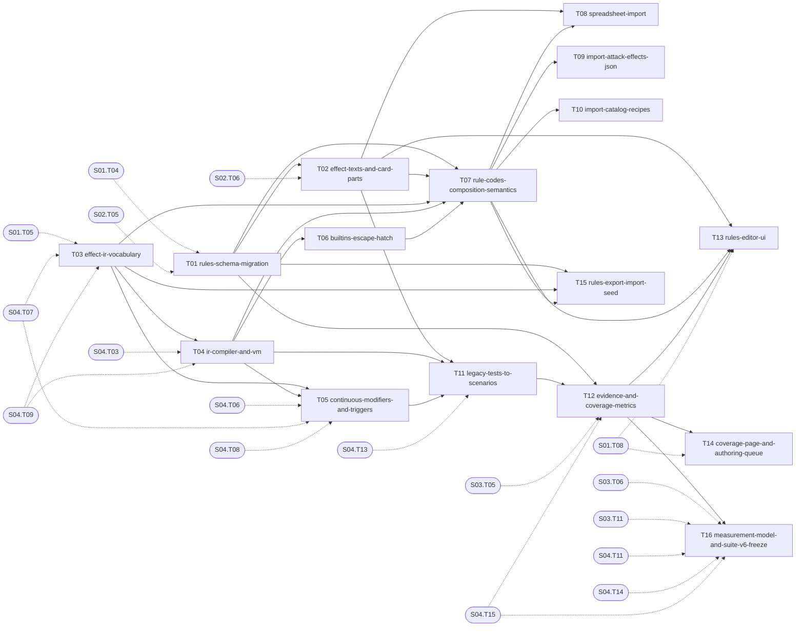

# S05 — Card rules base

| Field | Value |
|---|---|
| Status | TODO |
| Subtasks | 16 |
| Requires from other stages | [S01.T04](../01-foundation/T04-database-migration-framework.md), [S01.T05](../01-foundation/T05-shared-contracts-package.md), [S01.T08](../01-foundation/T08-web-skeleton.md), [S02.T05](../02-card-data-and-search/T05-cards-schema-migration.md), [S02.T06](../02-card-data-and-search/T06-load-cards.md), [S03.T05](../03-tournament-meta-and-deck-builder/T05-decks-sync-and-prune.md), [S03.T06](../03-tournament-meta-and-deck-builder/T06-meta-queries.md), [S03.T11](../03-tournament-meta-and-deck-builder/T11-user-decks-schema-and-api.md), [S04.T03](../04-game-engine-core/T03-game-state-model.md), [S04.T06](../04-game-engine-core/T06-energy-provision-and-cost-payment.md), [S04.T07](../04-game-engine-core/T07-damage-pipeline.md), [S04.T08](../04-game-engine-core/T08-special-conditions-and-checkup.md), [S04.T09](../04-game-engine-core/T09-prompt-protocol.md), [S04.T11](../04-game-engine-core/T11-baseline-bots-random-heuristic.md), [S04.T13](../04-game-engine-core/T13-scenario-format-and-runner.md), [S04.T14](../04-game-engine-core/T14-jobs-schema-migration.md), [S04.T15](../04-game-engine-core/T15-worker-job-runner.md) |
| Feeds other stages | [S06.T02](../06-bots/T02-deck-profile-analysis.md), [S06.T07](../06-bots/T07-bot-registry-and-freezing.md), [S06.T08](../06-bots/T08-measurement-score-and-mirror.md), [S07.T01](../07-deck-optimizer/T01-candidate-pool-and-move-generation.md), [S07.T02](../07-deck-optimizer/T02-paired-seed-screening.md), [S08.T05](../08-operations-and-extensions/T05-twinleaf-differential-oracle.md), [S08.T06](../08-operations-and-extensions/T06-llm-assisted-authoring.md) |

## Objective
Turn card text into executable data: every distinct effect text is split into sentences, each sentence maps to a rule code with parameters (the user's model), each code has an executable body in a closed effect IR interpreted by the engine, and every card's status (exact / proven) is derived from codes and evidence — with imports of the work already done (spreadsheet, 412 classified attacks, 262 recipes, 136 verified test parts) and a UI to author and audit.

## Exit criteria
- [ ] Rules tables populated from the spreadsheet and the legacy artefacts; every Standard card's parts linked to effect texts.
- [ ] Engine executes IR programs; all converted scenarios pass; evidence rows written by the worker.
- [ ] Coverage page shows exact ≥ 90 % and proven ≥ 60 % of meta copies (RN-03 denominator), split by evidence kind.
- [ ] Benchmark suite v6 frozen with the heuristic bot; first measurement stored with engine build and rules snapshot.

## Subtasks (execution order)
| # | ID | Title | Depends on | Gate | Status |
|---|---|---|---|---|---|
| 1 | [S05.T01](T01-rules-schema-migration.md) | Rules schema migration | [S01.T04](../01-foundation/T04-database-migration-framework.md), [S02.T05](../02-card-data-and-search/T05-cards-schema-migration.md) | no | TODO |
| 2 | [S05.T02](T02-effect-texts-and-card-parts.md) | Effect texts and card parts derivation | [S02.T06](../02-card-data-and-search/T06-load-cards.md), [S05.T01](T01-rules-schema-migration.md) | no | TODO |
| 3 | [S05.T03](T03-effect-ir-vocabulary.md) | Effect IR vocabulary | [S01.T05](../01-foundation/T05-shared-contracts-package.md), [S04.T07](../04-game-engine-core/T07-damage-pipeline.md), [S04.T09](../04-game-engine-core/T09-prompt-protocol.md) | no | TODO |
| 4 | [S05.T04](T04-ir-compiler-and-vm.md) | IR compiler and resumable VM | [S04.T03](../04-game-engine-core/T03-game-state-model.md), [S04.T09](../04-game-engine-core/T09-prompt-protocol.md), [S05.T03](T03-effect-ir-vocabulary.md) | no | TODO |
| 5 | [S05.T05](T05-continuous-modifiers-and-triggers.md) | Continuous modifiers and triggers | [S04.T06](../04-game-engine-core/T06-energy-provision-and-cost-payment.md), [S04.T07](../04-game-engine-core/T07-damage-pipeline.md), [S04.T08](../04-game-engine-core/T08-special-conditions-and-checkup.md), [S05.T03](T03-effect-ir-vocabulary.md), [S05.T04](T04-ir-compiler-and-vm.md) | no | TODO |
| 6 | [S05.T06](T06-builtins-escape-hatch.md) | Builtins escape hatch | [S05.T04](T04-ir-compiler-and-vm.md) | no | TODO |
| 7 | [S05.T07](T07-rule-codes-composition-semantics.md) | Rule codes: composition semantics | [S05.T01](T01-rules-schema-migration.md), [S05.T02](T02-effect-texts-and-card-parts.md), [S05.T03](T03-effect-ir-vocabulary.md), [S05.T04](T04-ir-compiler-and-vm.md), [S05.T06](T06-builtins-escape-hatch.md) | no | TODO |
| 8 | [S05.T08](T08-spreadsheet-import.md) | Spreadsheet import (sentences and codes) | [S05.T02](T02-effect-texts-and-card-parts.md), [S05.T07](T07-rule-codes-composition-semantics.md) | no | TODO |
| 9 | [S05.T09](T09-import-attack-effects-json.md) | Import legacy attack effects (412 attacks) | [S05.T07](T07-rule-codes-composition-semantics.md) | no | TODO |
| 10 | [S05.T10](T10-import-catalog-recipes.md) | Import legacy catalog recipes (262 recipes) | [S05.T07](T07-rule-codes-composition-semantics.md) | no | TODO |
| 11 | [S05.T11](T11-legacy-tests-to-scenarios.md) | Convert legacy verified tests into scenarios | [S04.T13](../04-game-engine-core/T13-scenario-format-and-runner.md), [S05.T02](T02-effect-texts-and-card-parts.md), [S05.T04](T04-ir-compiler-and-vm.md), [S05.T05](T05-continuous-modifiers-and-triggers.md) | no | TODO |
| 12 | [S05.T12](T12-evidence-and-coverage-metrics.md) | Evidence recording and coverage metrics | [S03.T05](../03-tournament-meta-and-deck-builder/T05-decks-sync-and-prune.md), [S04.T15](../04-game-engine-core/T15-worker-job-runner.md), [S05.T01](T01-rules-schema-migration.md), [S05.T11](T11-legacy-tests-to-scenarios.md) | no | TODO |
| 13 | [S05.T13](T13-rules-editor-ui.md) | Web: rules editor | [S01.T08](../01-foundation/T08-web-skeleton.md), [S05.T02](T02-effect-texts-and-card-parts.md), [S05.T07](T07-rule-codes-composition-semantics.md), [S05.T12](T12-evidence-and-coverage-metrics.md) | no | TODO |
| 14 | [S05.T14](T14-coverage-page-and-authoring-queue.md) | Web: coverage page and authoring queue | [S01.T08](../01-foundation/T08-web-skeleton.md), [S05.T12](T12-evidence-and-coverage-metrics.md) | no | TODO |
| 15 | [S05.T15](T15-rules-export-import-seed.md) | Rules export/import (versioned seed) | [S05.T01](T01-rules-schema-migration.md), [S05.T03](T03-effect-ir-vocabulary.md), [S05.T07](T07-rule-codes-composition-semantics.md) | no | TODO |
| 16 | [S05.T16](T16-measurement-model-and-suite-v6-freeze.md) | Measurement model and benchmark suite v6 freeze | [S03.T06](../03-tournament-meta-and-deck-builder/T06-meta-queries.md), [S03.T11](../03-tournament-meta-and-deck-builder/T11-user-decks-schema-and-api.md), [S04.T11](../04-game-engine-core/T11-baseline-bots-random-heuristic.md), [S04.T14](../04-game-engine-core/T14-jobs-schema-migration.md), [S04.T15](../04-game-engine-core/T15-worker-job-runner.md), [S05.T12](T12-evidence-and-coverage-metrics.md) | no | TODO |

Order follows the ID sequence; a subtask starts only when every "Depends on" item is DONE (see [Conventions](../../project/08-conventions.md)). Subtasks with the same topological level and no mutual dependency may run in parallel (listed in each file's "Parallel with").

## Dependency graph
Solid arrows: inside this stage. Dashed: inputs from earlier stages.

## Cross-stage interlocks
- Required inputs: [S01.T04](../01-foundation/T04-database-migration-framework.md), [S01.T05](../01-foundation/T05-shared-contracts-package.md), [S01.T08](../01-foundation/T08-web-skeleton.md), [S02.T05](../02-card-data-and-search/T05-cards-schema-migration.md), [S02.T06](../02-card-data-and-search/T06-load-cards.md), [S03.T05](../03-tournament-meta-and-deck-builder/T05-decks-sync-and-prune.md), [S03.T06](../03-tournament-meta-and-deck-builder/T06-meta-queries.md), [S03.T11](../03-tournament-meta-and-deck-builder/T11-user-decks-schema-and-api.md), [S04.T03](../04-game-engine-core/T03-game-state-model.md), [S04.T06](../04-game-engine-core/T06-energy-provision-and-cost-payment.md), [S04.T07](../04-game-engine-core/T07-damage-pipeline.md), [S04.T08](../04-game-engine-core/T08-special-conditions-and-checkup.md), [S04.T09](../04-game-engine-core/T09-prompt-protocol.md), [S04.T11](../04-game-engine-core/T11-baseline-bots-random-heuristic.md), [S04.T13](../04-game-engine-core/T13-scenario-format-and-runner.md), [S04.T14](../04-game-engine-core/T14-jobs-schema-migration.md), [S04.T15](../04-game-engine-core/T15-worker-job-runner.md)
- Delivered to: [S06.T02](../06-bots/T02-deck-profile-analysis.md), [S06.T07](../06-bots/T07-bot-registry-and-freezing.md), [S06.T08](../06-bots/T08-measurement-score-and-mirror.md), [S07.T01](../07-deck-optimizer/T01-candidate-pool-and-move-generation.md), [S07.T02](../07-deck-optimizer/T02-paired-seed-screening.md), [S08.T05](../08-operations-and-extensions/T05-twinleaf-differential-oracle.md), [S08.T06](../08-operations-and-extensions/T06-llm-assisted-authoring.md)

---
[Docs index](../../README.md) · [Conventions](../../project/08-conventions.md)
