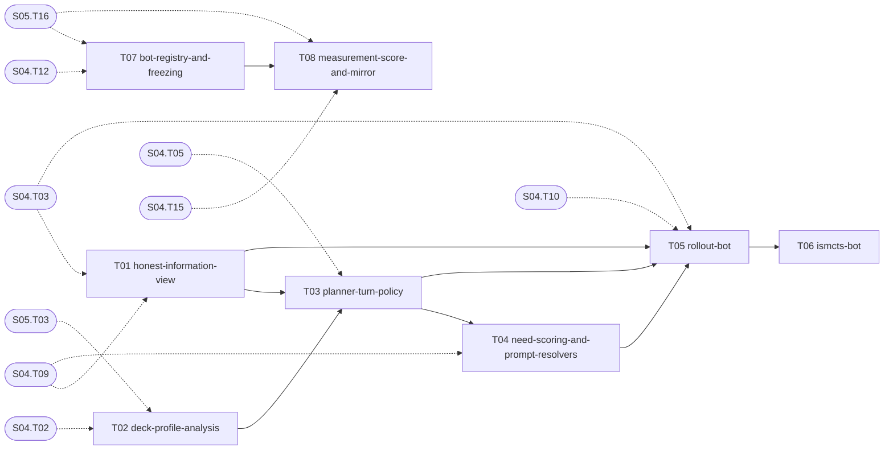

# S06 — Bots

| Field | Value |
|---|---|
| Status | TODO |
| Subtasks | 8 |
| Requires from other stages | [S04.T02](../04-game-engine-core/T02-card-definition-model.md), [S04.T03](../04-game-engine-core/T03-game-state-model.md), [S04.T05](../04-game-engine-core/T05-actions-and-legality.md), [S04.T09](../04-game-engine-core/T09-prompt-protocol.md), [S04.T10](../04-game-engine-core/T10-termination-stall-and-determinism.md), [S04.T12](../04-game-engine-core/T12-cli-job-protocol.md), [S04.T15](../04-game-engine-core/T15-worker-job-runner.md), [S05.T03](../05-card-rules-base/T03-effect-ir-vocabulary.md), [S05.T16](../05-card-rules-base/T16-measurement-model-and-suite-v6-freeze.md) |
| Feeds other stages | — |

## Objective
Give the engine competent, honest players: an information model that only sees what a real player sees, a deck-aware planner ported from the legacy pilot's rules, lookahead bots enabled by cheap state cloning, a registry with frozen versions, and the measurement job (score + mirror) that tells bot skill apart from deck quality.

## Exit criteria
- [ ] `planner_rs_v1` beats the heuristic bot in mirror matches with a 95 % CI excluding 50 % on suite v6.
- [ ] The rollout bot beats `planner_rs_v1` in mirror with a CI excluding 50 %; per-decision cost recorded in `docs/PERF.md`.
- [ ] Frozen bots are immutable (test) and every measurement row carries bot, engine build, rules snapshot and commit.

## Subtasks (execution order)
| # | ID | Title | Depends on | Gate | Status |
|---|---|---|---|---|---|
| 1 | [S06.T01](T01-honest-information-view.md) | Honest information view | [S04.T03](../04-game-engine-core/T03-game-state-model.md), [S04.T09](../04-game-engine-core/T09-prompt-protocol.md) | no | TODO |
| 2 | [S06.T02](T02-deck-profile-analysis.md) | Deck profile analysis | [S04.T02](../04-game-engine-core/T02-card-definition-model.md), [S05.T03](../05-card-rules-base/T03-effect-ir-vocabulary.md) | no | TODO |
| 3 | [S06.T03](T03-planner-turn-policy.md) | Planner bot: turn policy | [S04.T05](../04-game-engine-core/T05-actions-and-legality.md), [S06.T01](T01-honest-information-view.md), [S06.T02](T02-deck-profile-analysis.md) | no | TODO |
| 4 | [S06.T04](T04-need-scoring-and-prompt-resolvers.md) | Need scoring and prompt resolvers | [S04.T09](../04-game-engine-core/T09-prompt-protocol.md), [S06.T03](T03-planner-turn-policy.md) | no | TODO |
| 5 | [S06.T05](T05-rollout-bot.md) | Rollout bot (determinized playouts) | [S04.T03](../04-game-engine-core/T03-game-state-model.md), [S04.T10](../04-game-engine-core/T10-termination-stall-and-determinism.md), [S06.T01](T01-honest-information-view.md), [S06.T03](T03-planner-turn-policy.md), [S06.T04](T04-need-scoring-and-prompt-resolvers.md) | no | TODO |
| 6 | [S06.T06](T06-ismcts-bot.md) | ISMCTS bot | [S06.T05](T05-rollout-bot.md) | no | TODO |
| 7 | [S06.T07](T07-bot-registry-and-freezing.md) | Bot registry and freezing | [S04.T12](../04-game-engine-core/T12-cli-job-protocol.md), [S05.T16](../05-card-rules-base/T16-measurement-model-and-suite-v6-freeze.md) | no | TODO |
| 8 | [S06.T08](T08-measurement-score-and-mirror.md) | Measurement job: score and mirror | [S04.T15](../04-game-engine-core/T15-worker-job-runner.md), [S05.T16](../05-card-rules-base/T16-measurement-model-and-suite-v6-freeze.md), [S06.T07](T07-bot-registry-and-freezing.md) | no | TODO |

Order follows the ID sequence; a subtask starts only when every "Depends on" item is DONE (see [Conventions](../../project/08-conventions.md)). Subtasks with the same topological level and no mutual dependency may run in parallel (listed in each file's "Parallel with").

## Dependency graph
Solid arrows: inside this stage. Dashed: inputs from earlier stages.

## Cross-stage interlocks
- Required inputs: [S04.T02](../04-game-engine-core/T02-card-definition-model.md), [S04.T03](../04-game-engine-core/T03-game-state-model.md), [S04.T05](../04-game-engine-core/T05-actions-and-legality.md), [S04.T09](../04-game-engine-core/T09-prompt-protocol.md), [S04.T10](../04-game-engine-core/T10-termination-stall-and-determinism.md), [S04.T12](../04-game-engine-core/T12-cli-job-protocol.md), [S04.T15](../04-game-engine-core/T15-worker-job-runner.md), [S05.T03](../05-card-rules-base/T03-effect-ir-vocabulary.md), [S05.T16](../05-card-rules-base/T16-measurement-model-and-suite-v6-freeze.md)
- Delivered to: —

---
[Docs index](../../README.md) · [Conventions](../../project/08-conventions.md)
