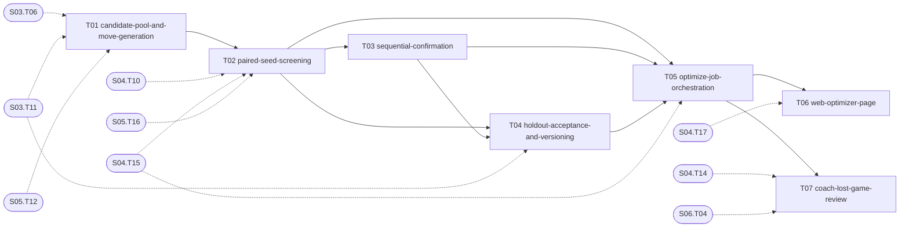

# S07 — Deck optimizer

| Field | Value |
|---|---|
| Status | TODO |
| Subtasks | 7 |
| Requires from other stages | [S03.T06](../03-tournament-meta-and-deck-builder/T06-meta-queries.md), [S03.T11](../03-tournament-meta-and-deck-builder/T11-user-decks-schema-and-api.md), [S04.T10](../04-game-engine-core/T10-termination-stall-and-determinism.md), [S04.T14](../04-game-engine-core/T14-jobs-schema-migration.md), [S04.T15](../04-game-engine-core/T15-worker-job-runner.md), [S04.T17](../04-game-engine-core/T17-web-evaluate-page.md), [S05.T12](../05-card-rules-base/T12-evidence-and-coverage-metrics.md), [S05.T16](../05-card-rules-base/T16-measurement-model-and-suite-v6-freeze.md), [S06.T04](../06-bots/T04-need-scoring-and-prompt-resolvers.md) |
| Feeds other stages | — |

## Objective
Turn the engine's speed into confirmed advice: propose one-card swaps from what the archetype actually plays, screen them on paired seeds, confirm survivors sequentially on fresh seeds with multiplicity control, accept only what clears a practical threshold, and report the holdout number — so a suggested change is a measured gain, not noise fitted to seeds.

## Exit criteria
- [ ] Reproduce the legacy Dhelmise cycle on suite v6: either a swap confirmed on holdout seeds or an explicit 'no swap outside noise' with CIs, in under 15 minutes wall-clock.
- [ ] Every candidate's screening/confirmation numbers and decision are stored and visible.

## Subtasks (execution order)
| # | ID | Title | Depends on | Gate | Status |
|---|---|---|---|---|---|
| 1 | [S07.T01](T01-candidate-pool-and-move-generation.md) | Candidate pool and move generation | [S03.T06](../03-tournament-meta-and-deck-builder/T06-meta-queries.md), [S03.T11](../03-tournament-meta-and-deck-builder/T11-user-decks-schema-and-api.md), [S05.T12](../05-card-rules-base/T12-evidence-and-coverage-metrics.md) | no | TODO |
| 2 | [S07.T02](T02-paired-seed-screening.md) | Paired-seed screening | [S04.T10](../04-game-engine-core/T10-termination-stall-and-determinism.md), [S04.T15](../04-game-engine-core/T15-worker-job-runner.md), [S05.T16](../05-card-rules-base/T16-measurement-model-and-suite-v6-freeze.md), [S07.T01](T01-candidate-pool-and-move-generation.md) | no | TODO |
| 3 | [S07.T03](T03-sequential-confirmation.md) | Sequential confirmation | [S07.T02](T02-paired-seed-screening.md) | no | TODO |
| 4 | [S07.T04](T04-holdout-acceptance-and-versioning.md) | Holdout acceptance and versioning | [S03.T11](../03-tournament-meta-and-deck-builder/T11-user-decks-schema-and-api.md), [S07.T02](T02-paired-seed-screening.md), [S07.T03](T03-sequential-confirmation.md) | no | TODO |
| 5 | [S07.T05](T05-optimize-job-orchestration.md) | Optimize job orchestration | [S04.T15](../04-game-engine-core/T15-worker-job-runner.md), [S07.T02](T02-paired-seed-screening.md), [S07.T03](T03-sequential-confirmation.md), [S07.T04](T04-holdout-acceptance-and-versioning.md) | no | TODO |
| 6 | [S07.T06](T06-web-optimizer-page.md) | Web: optimizer page | [S04.T17](../04-game-engine-core/T17-web-evaluate-page.md), [S07.T05](T05-optimize-job-orchestration.md) | no | TODO |
| 7 | [S07.T07](T07-coach-lost-game-review.md) | Coach: lost-game review (optional LLM) | [S04.T14](../04-game-engine-core/T14-jobs-schema-migration.md), [S06.T04](../06-bots/T04-need-scoring-and-prompt-resolvers.md), [S07.T05](T05-optimize-job-orchestration.md) | no | TODO |

Order follows the ID sequence; a subtask starts only when every "Depends on" item is DONE (see [Conventions](../../project/08-conventions.md)). Subtasks with the same topological level and no mutual dependency may run in parallel (listed in each file's "Parallel with").

## Dependency graph
Solid arrows: inside this stage. Dashed: inputs from earlier stages.

## Cross-stage interlocks
- Required inputs: [S03.T06](../03-tournament-meta-and-deck-builder/T06-meta-queries.md), [S03.T11](../03-tournament-meta-and-deck-builder/T11-user-decks-schema-and-api.md), [S04.T10](../04-game-engine-core/T10-termination-stall-and-determinism.md), [S04.T14](../04-game-engine-core/T14-jobs-schema-migration.md), [S04.T15](../04-game-engine-core/T15-worker-job-runner.md), [S04.T17](../04-game-engine-core/T17-web-evaluate-page.md), [S05.T12](../05-card-rules-base/T12-evidence-and-coverage-metrics.md), [S05.T16](../05-card-rules-base/T16-measurement-model-and-suite-v6-freeze.md), [S06.T04](../06-bots/T04-need-scoring-and-prompt-resolvers.md)
- Delivered to: —

---
[Docs index](../../README.md) · [Conventions](../../project/08-conventions.md)
