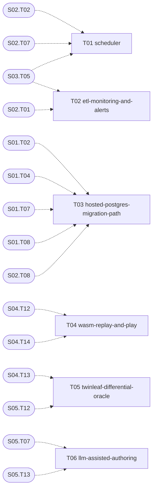

# S08 — Operations and extensions

| Field | Value |
|---|---|
| Status | TODO |
| Subtasks | 6 |
| Requires from other stages | [S01.T02](../01-foundation/T02-sqlite-database-client.md), [S01.T04](../01-foundation/T04-database-migration-framework.md), [S01.T07](../01-foundation/T07-api-skeleton-and-health.md), [S01.T08](../01-foundation/T08-web-skeleton.md), [S02.T01](../02-card-data-and-search/T01-etl-cli-and-raw-cache.md), [S02.T02](../02-card-data-and-search/T02-fetch-pokemon-tcg-data.md), [S02.T07](../02-card-data-and-search/T07-prices-snapshot.md), [S02.T08](../02-card-data-and-search/T08-full-text-search.md), [S03.T05](../03-tournament-meta-and-deck-builder/T05-decks-sync-and-prune.md), [S04.T12](../04-game-engine-core/T12-cli-job-protocol.md), [S04.T13](../04-game-engine-core/T13-scenario-format-and-runner.md), [S04.T14](../04-game-engine-core/T14-jobs-schema-migration.md), [S05.T07](../05-card-rules-base/T07-rule-codes-composition-semantics.md), [S05.T12](../05-card-rules-base/T12-evidence-and-coverage-metrics.md), [S05.T13](../05-card-rules-base/T13-rules-editor-ui.md) |
| Feeds other stages | — |

## Objective
Keep the system current and trustworthy without manual work (scheduled ETL, monitoring), prepare the path to a hosted Postgres, and add the extensions that the core makes possible: in-browser replay/play via WASM, a second-engine oracle for rule evidence, and optional LLM help for rule authoring.

## Exit criteria
- [ ] Daily prices/decks and weekly delta run unattended with `etl_runs` rows and alerts on failure or empty results.
- [ ] A documented, tested migration path to a Supabase-like Postgres (schema + data) exists.
- [ ] Replay of any stored game in the browser; oracle evidence kind in use for at least the top 50 texts.

## Subtasks (execution order)
| # | ID | Title | Depends on | Gate | Status |
|---|---|---|---|---|---|
| 1 | [S08.T01](T01-scheduler.md) | Scheduler | [S02.T02](../02-card-data-and-search/T02-fetch-pokemon-tcg-data.md), [S02.T07](../02-card-data-and-search/T07-prices-snapshot.md), [S03.T05](../03-tournament-meta-and-deck-builder/T05-decks-sync-and-prune.md) | no | TODO |
| 2 | [S08.T02](T02-etl-monitoring-and-alerts.md) | ETL monitoring and alerts | [S02.T01](../02-card-data-and-search/T01-etl-cli-and-raw-cache.md), [S03.T05](../03-tournament-meta-and-deck-builder/T05-decks-sync-and-prune.md) | no | TODO |
| 3 | [S08.T03](T03-hosted-postgres-migration-path.md) | Hosted Postgres migration path | [S01.T02](../01-foundation/T02-sqlite-database-client.md), [S01.T04](../01-foundation/T04-database-migration-framework.md), [S01.T07](../01-foundation/T07-api-skeleton-and-health.md), [S01.T08](../01-foundation/T08-web-skeleton.md), [S02.T08](../02-card-data-and-search/T08-full-text-search.md) | no | TODO |
| 4 | [S08.T04](T04-wasm-replay-and-play.md) | WASM replay and play | [S04.T12](../04-game-engine-core/T12-cli-job-protocol.md), [S04.T14](../04-game-engine-core/T14-jobs-schema-migration.md) | no | TODO |
| 5 | [S08.T05](T05-twinleaf-differential-oracle.md) | Twinleaf differential oracle | [S04.T13](../04-game-engine-core/T13-scenario-format-and-runner.md), [S05.T12](../05-card-rules-base/T12-evidence-and-coverage-metrics.md) | no | TODO |
| 6 | [S08.T06](T06-llm-assisted-authoring.md) | LLM-assisted rule authoring (optional) | [S05.T07](../05-card-rules-base/T07-rule-codes-composition-semantics.md), [S05.T13](../05-card-rules-base/T13-rules-editor-ui.md) | no | TODO |

Order follows the ID sequence; a subtask starts only when every "Depends on" item is DONE (see [Conventions](../../project/08-conventions.md)). Subtasks with the same topological level and no mutual dependency may run in parallel (listed in each file's "Parallel with").

## Dependency graph
Solid arrows: inside this stage. Dashed: inputs from earlier stages.

## Cross-stage interlocks
- Required inputs: [S01.T02](../01-foundation/T02-sqlite-database-client.md), [S01.T04](../01-foundation/T04-database-migration-framework.md), [S01.T07](../01-foundation/T07-api-skeleton-and-health.md), [S01.T08](../01-foundation/T08-web-skeleton.md), [S02.T01](../02-card-data-and-search/T01-etl-cli-and-raw-cache.md), [S02.T02](../02-card-data-and-search/T02-fetch-pokemon-tcg-data.md), [S02.T07](../02-card-data-and-search/T07-prices-snapshot.md), [S02.T08](../02-card-data-and-search/T08-full-text-search.md), [S03.T05](../03-tournament-meta-and-deck-builder/T05-decks-sync-and-prune.md), [S04.T12](../04-game-engine-core/T12-cli-job-protocol.md), [S04.T13](../04-game-engine-core/T13-scenario-format-and-runner.md), [S04.T14](../04-game-engine-core/T14-jobs-schema-migration.md), [S05.T07](../05-card-rules-base/T07-rule-codes-composition-semantics.md), [S05.T12](../05-card-rules-base/T12-evidence-and-coverage-metrics.md), [S05.T13](../05-card-rules-base/T13-rules-editor-ui.md)
- Delivered to: —

---
[Docs index](../../README.md) · [Conventions](../../project/08-conventions.md)
