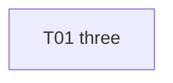

# S02 — Beta

| Field | Value |
|---|---|
| Status | TODO |
| Subtasks | 1 |
| Requires from other stages | [S01.T01](../01-alpha/T01-one.md) |
| Feeds other stages | — |

## Objective
Fixture stage with one subtask.

## Exit criteria
- [ ] The subtask is DONE.

## Subtasks (execution order)
| # | ID | Title | Depends on | Gate | Status |
|---|---|---|---|---|---|
| 1 | [S02.T01](T01-three.md) | Three | [S01.T01](../01-alpha/T01-one.md) | yes | TODO |

Order follows the ID sequence.

## Dependency graph

## Cross-stage interlocks
- Required inputs: [S01.T01](../01-alpha/T01-one.md)
- Delivered to: —

---
[Docs index](../../README.md) · [Conventions](../../project/08-conventions.md)
