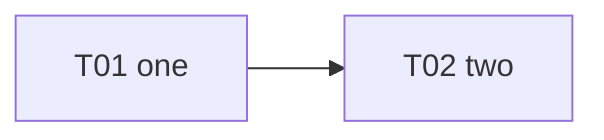

# S01 — Alpha

| Field | Value |
|---|---|
| Status | TODO |
| Subtasks | 2 |
| Requires from other stages | — |
| Feeds other stages | [S02.T01](../02-beta/T01-three.md) |

## Objective
Fixture stage with two subtasks.

## Exit criteria
- [ ] Both subtasks are DONE.

## Subtasks (execution order)
| # | ID | Title | Depends on | Gate | Status |
|---|---|---|---|---|---|
| 1 | [S01.T01](T01-one.md) | One | — | no | TODO |
| 1 | [S01.T01](T01-one.md) | One | — | no | TODO |
| 2 | [S01.T02](T02-two.md) | Two | [S01.T01](T01-one.md) | no | TODO |

Order follows the ID sequence.

## Dependency graph

## Cross-stage interlocks
- Required inputs: —
- Delivered to: [S02.T01](../02-beta/T01-three.md)

---
[Docs index](../../README.md) · [Conventions](../../project/08-conventions.md)
